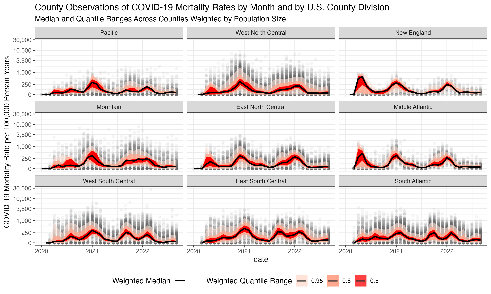
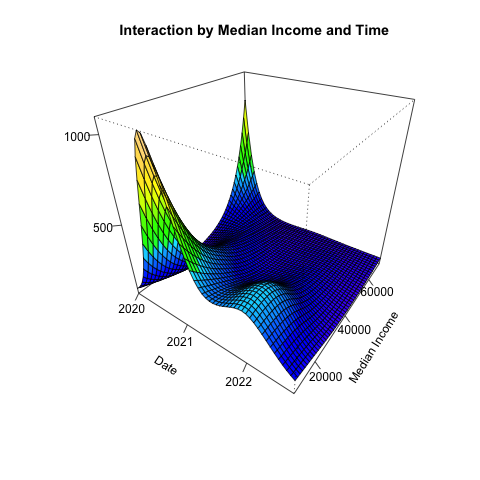
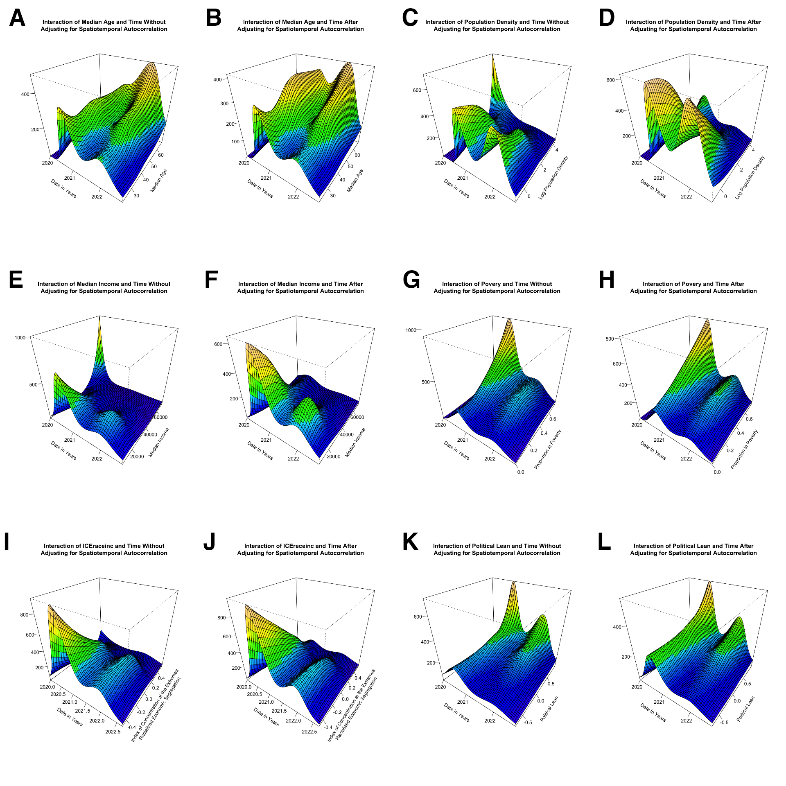

# Analyzing COVID-19 County Mortality Data from the US with Generalized Additive Models

## Repository Overview

This repository is home to the `covid.gradient.estimation` package which houses
functions to clean, merge, and analyze data from a variety of sources on county-level
COVID-19 outcomes, sociodemographic measures, and geography using generalized additive
models (GAMs).

This package can be installed by running:

```r
install.packages("devtools")
devtools::install_github("ctesta01/covid.gradient.estimation")
```

Inside the `R/` directory are the functions built into the package, which 
clean and merge the data stored inside `inst/` to create the analytic dataset
that we investigate in the `analysis/` code. 

```
R
├── create_analytic_dataset.R   # merge datasets together
├── get_absms_from_acs.R        # get area-based social metrics from the American Community Survey
├── get_popsizes.R              # get the 2020 population estimates from the Census
├── load_covid19_deaths.R       # load the NYTimes COVID-19 death counts
└── load_political_lean.R       # load the MIT Election Lab votes cast data
```

There are several datasets installed in the package in the `inst/` directory.
Those include a cached copy of the county-level area based social metrics
so that we don't have to query the American Community Survey API every time we 
recreate our analytic dataset, the COVID-19 deaths from CDC WONDER and NYTimes,
and the votes cast by county data from the MIT Election Lab.  

```
inst
├── cached_absms.rds
├── mit_election_lab
│   └── countypres_2000-2020.csv
└── nytimes
    ├── us-counties-2020.csv
    ├── us-counties-2021.csv
    └── us-counties-2022.csv
```

The analysis work and figure generation is done in the `analysis/`
directory, where discrete analytic tasks are organized by directories numbered in 
the order of analysis steps. 

The analyses `01` through `03` can be considered
exploratory data analyses, with `04`, `05` main analyses for the non-spatial 
modeling results, `06` and `07` supplementary analyses meant to inform the 
spatial modeling approach, and `08` exploratory data analysis to illustrate
the importance of taking spatiotemporal autocorrelation into account. `09`
includes the code to run the models which assess the association of varying
county-level covariates and COVID-19 mortality after taking into account a
spatiotemporal latent surface. `10` contains the code necessary to generate the 
figure illustrating how spline basis functions are used in a GAM. 

```
analysis
├── 01_state_trajectories
├── 02_plot_county_trends
├── 03_county_distributions
├── 04_one_variable_over_time
├── 05_two_variables_at_a_time
├── 06_random_forest
├── 07_xgboost
├── 08_spatiotemporal_autocorrelation
├── 09_spatiotemporal_models
└── 10_supplementary_gam_figures
```

Finally, the manuscript is produced in the `manuscript/` directory.

## Figures




### Non-Spatial GAM Figures




### Spatial Smoothing GAM Figures


### Effects Associated with Covariates Before and After Adjusting for Spatiotemporal Autocorrelation Figure



## Software Dependencies

This project uses `renv` to manage dependencies so that the analyses can be 
reproduced exactly down to the same release version of each package used. 

After cloning this repository and installing `renv`, you can activate `renv` and
restore the packages as they were used to conduct these analyses using
`renv::restore()`.

```
# CRAN ===============================
- DBI              [* -> 1.1.3]
- GGally           [* -> 2.1.2]
- HDInterval       [* -> 0.2.2]
- KernSmooth       [* -> 2.23-20]
- MASS             [* -> 7.3-56]
- Matrix           [* -> 1.4-1]
- R6               [* -> 2.5.1]
- RColorBrewer     [* -> 1.1-3]
- Rcpp             [* -> 1.0.9]
- RcppEigen        [* -> 0.3.3.9.2]
- askpass          [* -> 1.1]
- base64enc        [* -> 0.1-3]
- bit              [* -> 4.0.4]
- bit64            [* -> 4.0.5]
- boot             [* -> 1.3-28]
- brew             [* -> 1.0-8]
- brio             [* -> 1.1.3]
- bslib            [* -> 0.4.0]
- cachem           [* -> 1.0.6]
- callr            [* -> 3.7.2]
- class            [* -> 7.3-20]
- classInt         [* -> 0.4-8]
- cli              [* -> 3.4.1]
- clipr            [* -> 0.8.0]
- codetools        [* -> 0.2-18]
- colorspace       [* -> 2.0-3]
- commonmark       [* -> 1.8.0]
- cpp11            [* -> 0.4.2]
- crayon           [* -> 1.5.2]
- credentials      [* -> 1.3.2]
- crosstalk        [* -> 1.2.0]
- curl             [* -> 4.3.2]
- data.table       [* -> 1.14.2]
- deldir           [* -> 1.0-6]
- desc             [* -> 1.4.2]
- devtools         [* -> 2.4.4]
- diffobj          [* -> 0.3.5]
- digest           [* -> 0.6.29]
- distributional   [* -> 0.3.1]
- doParallel       [* -> 1.0.17]
- downlit          [* -> 0.4.2]
- dplyr            [* -> 1.0.10]
- e1071            [* -> 1.7-11]
- ellipsis         [* -> 0.3.2]
- evaluate         [* -> 0.16]
- fansi            [* -> 1.0.3]
- farver           [* -> 2.1.1]
- fastmap          [* -> 1.1.0]
- fontawesome      [* -> 0.3.0]
- forcats          [* -> 0.5.2]
- foreach          [* -> 1.5.2]
- foreign          [* -> 0.8-82]
- fs               [* -> 1.5.2]
- gamm4            [* -> 0.2-6]
- generics         [* -> 0.1.3]
- gert             [* -> 1.9.0]
- ggcorrplot       [* -> 0.1.4]
- ggdist           [* -> 3.2.0]
- ggplot2          [* -> 3.3.6]
- ggridges         [* -> 0.5.4]
- gh               [* -> 1.3.1]
- gitcreds         [* -> 0.1.2]
- glue             [* -> 1.6.2]
- gridExtra        [* -> 2.3]
- gtable           [* -> 0.3.1]
- here             [* -> 1.0.1]
- highr            [* -> 0.9]
- hms              [* -> 1.1.2]
- htmltools        [* -> 0.5.3]
- htmlwidgets      [* -> 1.5.4]
- httpuv           [* -> 1.6.6]
- httr             [* -> 1.4.4]
- ini              [* -> 0.3.1]
- isoband          [* -> 0.2.5]
- iterators        [* -> 1.0.14]
- janitor          [* -> 2.1.0]
- jquerylib        [* -> 0.1.4]
- jsonlite         [* -> 1.8.2]
- knitr            [* -> 1.40]
- labeling         [* -> 0.4.2]
- later            [* -> 1.3.0]
- lattice          [* -> 0.20-45]
- lazyeval         [* -> 0.2.2]
- lifecycle        [* -> 1.0.2]
- lme4             [* -> 1.1-30]
- lubridate        [* -> 1.8.0]
- magrittr         [* -> 2.0.3]
- mapproj          [* -> 1.2.8]
- maps             [* -> 3.4.0]
- maptools         [* -> 1.1-4]
- matrixStats      [* -> 0.62.0]
- memoise          [* -> 2.0.1]
- mgcViz           [* -> 0.1.9]
- mgcv             [* -> 1.8-40]
- mime             [* -> 0.12]
- miniUI           [* -> 0.1.1.1]
- minqa            [* -> 1.2.4]
- munsell          [* -> 0.5.0]
- nlme             [* -> 3.1-157]
- nloptr           [* -> 2.0.3]
- numDeriv         [* -> 2016.8-1.1]
- openssl          [* -> 2.0.3]
- pillar           [* -> 1.8.1]
- pkgbuild         [* -> 1.3.1]
- pkgconfig        [* -> 2.0.3]
- pkgdown          [* -> 2.0.6]
- pkgload          [* -> 1.3.0]
- plotly           [* -> 4.10.0]
- plyr             [* -> 1.8.7]
- praise           [* -> 1.0.0]
- prettyunits      [* -> 1.1.1]
- processx         [* -> 3.7.0]
- profvis          [* -> 0.3.7]
- progress         [* -> 1.2.2]
- promises         [* -> 1.2.0.1]
- proxy            [* -> 0.4-27]
- ps               [* -> 1.7.1]
- purrr            [* -> 0.3.4]
- qgam             [* -> 1.3.4]
- ragg             [* -> 1.2.3]
- ranger           [* -> 0.14.1]
- rappdirs         [* -> 0.3.3]
- rcmdcheck        [* -> 1.4.0]
- readr            [* -> 2.1.3]
- rematch2         [* -> 2.1.2]
- remotes          [* -> 2.4.2]
- reshape          [* -> 0.8.9]
- reshape2         [* -> 1.4.4]
- rgdal            [* -> 1.5-32]
- rlang            [* -> 1.0.6]
- rmarkdown        [* -> 2.16]
- roxygen2         [* -> 7.2.1]
- rprojroot        [* -> 2.0.3]
- rstudioapi       [* -> 0.14]
- rversions        [* -> 2.1.2]
- rvest            [* -> 1.0.3]
- s2               [* -> 1.1.0]
- sass             [* -> 0.4.2]
- scales           [* -> 1.2.1]
- selectr          [* -> 0.4-2]
- sessioninfo      [* -> 1.2.2]
- sf               [* -> 1.0-8]
- shiny            [* -> 1.7.2]
- snakecase        [* -> 0.11.0]
- sourcetools      [* -> 0.1.7]
- sp               [* -> 1.5-0]
- spData           [* -> 2.2.0]
- spdep            [* -> 1.2-7]
- stringi          [* -> 1.7.8]
- stringr          [* -> 1.4.1]
- sys              [* -> 3.4]
- systemfonts      [* -> 1.0.4]
- testthat         [* -> 3.1.4]
- textshaping      [* -> 0.3.6]
- tibble           [* -> 3.1.8]
- tidycensus       [* -> 1.2.3]
- tidyr            [* -> 1.2.1]
- tidyselect       [* -> 1.1.2]
- tigris           [* -> 1.6.1]
- tinytex          [* -> 0.42]
- tzdb             [* -> 0.3.0]
- units            [* -> 0.8-0]
- urlchecker       [* -> 1.0.1]
- usethis          [* -> 2.1.6]
- utf8             [* -> 1.2.2]
- uuid             [* -> 1.1-0]
- vctrs            [* -> 0.4.2]
- vip              [* -> 0.3.2]
- viridis          [* -> 0.6.2]
- viridisLite      [* -> 0.4.1]
- vroom            [* -> 1.6.0]
- waldo            [* -> 0.4.0]
- whisker          [* -> 0.4]
- withr            [* -> 2.5.0]
- wk               [* -> 0.6.0]
- xfun             [* -> 0.33]
- xgboost          [* -> 1.6.0.1]
- xml2             [* -> 1.3.3]
- xopen            [* -> 1.0.0]
- xtable           [* -> 1.8-4]
- yaml             [* -> 2.3.5]
- zip              [* -> 2.2.1]
```

Read the manuscript in its current form: [manuscript.pdf](manuscript/manuscript.pdf)
